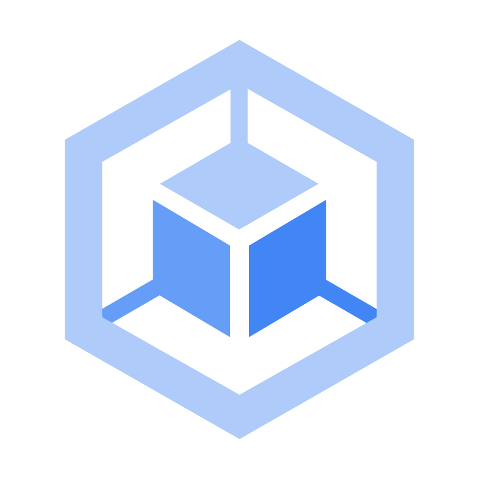
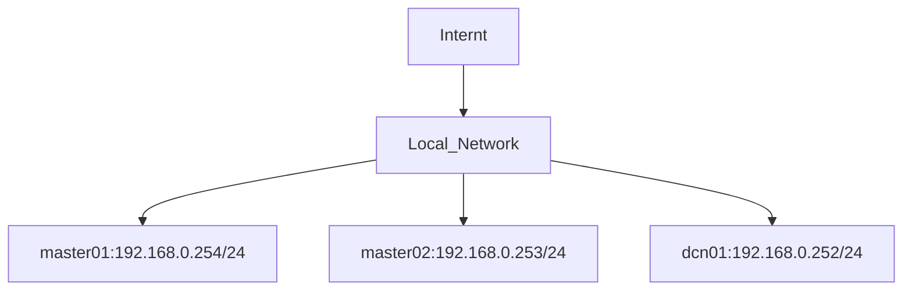

# Learning Kubernetes by Example
This is a Kubernetes learning project that aims to improve technical skills in managing microservices clusters.

<!-- Improved compatibility of back to top link: See: https://github.com/othneildrew/Best-README-Template/pull/73 -->

<!--
*** Thanks for checking out the Best-README-Template. If you have a suggestion
*** that would make this better, please fork the repo and create a pull request
*** or simply open an issue with the tag "enhancement".
*** Don't forget to give the project a star!
*** Thanks again! Now go create something AMAZING! :D
-->

<!-- PROJECT SHIELDS -->
<!--
*** I'm using markdown "reference style" links for readability.
*** Reference links are enclosed in brackets [ ] instead of parentheses ( ).
*** See the bottom of this document for the declaration of the reference variables
*** for contributors-url, forks-url, etc. This is an optional, concise syntax you may use.
*** https://www.markdownguide.org/basic-syntax/#reference-style-links
-->
[![Contributors][contributors-shield]][contributors-url]
[![Forks][forks-shield]][forks-url]
[![Stargazers][stars-shield]][stars-url]
[![Issues][issues-shield]][issues-url]
[![project_license][license-shield]][license-url]
[![LinkedIn][linkedin-shield]][linkedin-url]

<!-- PROJECT LOGO -->
 

  

<h3 align="center">Learning Kubernetes by Example</h3>

This is a Kubernetes learning project that aims to improve technical skills in managing microservices clusters. At the end, a declarative infrastructure consisting of a Kubernetes cluster and three compute nodes will be deployed, two of which are HA control nodes and one exclusively for workload.

     
    <a href="https://github.com/salesfilho/learning-kubernetes"><strong>Explore the docs »</strong></a>
     
     
    <a href="https://github.com/salesfilho/learning-kubernetes">View Demo</a>
    &middot;
    <a href="https://github.com/salesfilho/learning-kubernetes/issues/new?labels=bug&template=bug-report---.md">Report Bug</a>
    &middot;
    <a href="https://github.com/salesfilho/learning-kubernetes/issues/new?labels=enhancement&template=feature-request---.md">Request Feature</a>
  

<!-- ABOUT THE PROJECT -->
## About The Project

This lab demonstrates how to create a three-node Kubernetes cluster in HA using [Microk8s](https://github.com/canonical/microk8s/blob/master/README.md). It also demonstrates how to configure the certificate management, loadbalancer, and ArgoCD services.

(<a href="#readme-top">back to top</a>)

### Built With
[![ubuntu][Ubuntu]][ubuntu-url]
[![virtualbox][VirtualBox]][virtualbox-url]
[![kubernetes][Kubernetes]][kubernetes-url]
[![argocd][ArgoCD]][argocd-url]

(<a href="#readme-top">back to top</a>)

<!-- GETTING STARTED -->
## Getting Started

This example was implemented using a host computer (MacOS M2) with 16GB RAM and three virtual machines (VMs) running on VirtualBox. Each VM was configured with 2 vCPUs, 4GB RAM, and a 25GB virtual disk.

### Prerequisites

* 02 Control-Plane nodes (master01 and master02)
* 01 Work node (dcn01)
* All nodes with Internet access
* Ubuntu Server 24.04.2 LTS
* MicroK8s v1.32.2 revision 7734

## Install and Configure Cluster

1. [Creating a High Availability (HA) Kubernetes Cluster Using Three Nodes
](https://github.com/salesfilho/learning-kubernetes/blob/main/cluster/README.md)

2. [Configure the Certification Management](https://github.com/salesfilho/learning-kubernetes/tree/main/cluster/cert-manager
)
3. [Configure Cluster LoadBalancer](https://github.com/salesfilho/learning-kubernetes/tree/main/cluster/LoadBalancer)
4. [Install and Configure ArgoCD](https://github.com/salesfilho/learning-kubernetes/tree/main/cluster/LoadBalancer)

(<a href="#readme-top">back to top</a>)

<!-- USAGE EXAMPLES -->
## Deploy Application

WIP

(<a href="#readme-top">back to top</a>)

<!-- ROADMAP -->
## Roadmap

- [x] HA Kubernetes Cluster
- [x] Local Certification Management
- [x] Ingress LoadBalancer
- [ ] Deploy ArgoCD App-of-Apps
- [ ] Add CD pipiline
- [ ] Test third-party orchestrator

See the [open issues](https://github.com/salesfilho/learning-kubernetes/issues) for a full list of proposed features (and known issues).

(<a href="#readme-top">back to top</a>)

<!-- CONTRIBUTING -->
## Contributing

Contributions are what make the open source community such an amazing place to learn, inspire, and create. Any contributions you make are **greatly appreciated**.

If you have a suggestion that would make this better, please fork the repo and create a pull request. You can also simply open an issue with the tag "enhancement".
Don't forget to give the project a star! Thanks again!

1. Fork the Project
2. Create your Feature Branch (`git checkout -b feature/AmazingFeature`)
3. Commit your Changes (`git commit -m 'Add some AmazingFeature'`)
4. Push to the Branch (`git push origin feature/AmazingFeature`)
5. Open a Pull Request

(<a href="#readme-top">back to top</a>)

### Top contributors:

<!-- LICENSE -->
## License

Distributed under the MIT License. See `LICENSE.txt` for more information.

(<a href="#readme-top">back to top</a>)

<!-- CONTACT -->
## Contact

Sales Filho - [LinkedIn](https://www.linkedin.com/in/salesfilho/) - sales.filho@ifrn.edu.br

Project Link: [https://github.com/salesfilho/learning-kubernetes](https://github.com/salesfilho/learning-kubernetes)

(<a href="#readme-top">back to top</a>)

<!-- ACKNOWLEDGMENTS -->
## Acknowledgments

* [IFRN/CNAT](https://portal.ifrn.edu.br/campus/natalcentral/)
* [UFRN/LAUT](http://laut.dca.ufrn.br/)
* [NOVA SMAR](https://www.smar.com.br/)
* [MED5 TECNOLOGIA](https://www.med5.com.br/)

(<a href="#readme-top">back to top</a>)

<!-- MARKDOWN LINKS & IMAGES -->
<!-- https://www.markdownguide.org/basic-syntax/#reference-style-links -->
[contributors-shield]: https://img.shields.io/github/contributors/salesfilho/learning-kubernetes.svg?style=for-the-badge
[contributors-url]: https://github.com/salesfilho/learning-kubernetes/graphs/contributors
[forks-shield]: https://img.shields.io/github/forks/salesfilho/learning-kubernetes.svg?style=for-the-badge
[forks-url]: https://github.com/salesfilho/learning-kubernetes/network/members
[stars-shield]: https://img.shields.io/github/stars/salesfilho/learning-kubernetes.svg?style=for-the-badge
[stars-url]: https://github.com/salesfilho/learning-kubernetes/stargazers

[issues-shield]: https://img.shields.io/github/issues/salesfilho/learning-kubernetes.svg?style=for-the-badge
[issues-url]: https://github.com/salesfilho/learning-kubernetes/issues

[license-shield]: https://img.shields.io/github/license/salesfilho/learning-kubernetes.svg?style=for-the-badge
[license-url]: https://github.com/salesfilho/learning-kubernetes/blob/master/LICENSE.md

[linkedin-shield]: https://img.shields.io/badge/-LinkedIn-black.svg?style=for-the-badge&logo=linkedin&colorB=555
[linkedin-url]: https://www.linkedin.com/in/salesfilho/

[kubernetes]: https://img.shields.io/badge/kubernetes-326CE5?&style=plastic&logo=kubernetes&logoColor=white
[kubernetes-url]: https://kubernetes.io/

[argocd]: https://img.shields.io/badge/Argocd-EF7B4D?&style=plastic&logo=Argo&logoColor=white
[argocd-url]: https://argo-cd.readthedocs.io/en/stable/

[ubuntu]: https://img.shields.io/badge/Ubuntu-fff?logo=Ubuntu&logoColor=fff&color=E95420
[ubuntu-url]: https://ubuntu.com/download

[virtualbox]: https://img.shields.io/badge/VirtualBox-Experienced-yellowgreen
[virtualbox-url]: https://www.virtualbox.org/

[Next.js]: https://img.shields.io/badge/next.js-000000?style=for-the-badge&logo=nextdotjs&logoColor=white
[Next-url]: https://nextjs.org/

[React.js]: https://img.shields.io/badge/React-20232A?style=for-the-badge&logo=react&logoColor=61DAFB
[React-url]: https://reactjs.org/
[Vue.js]: https://img.shields.io/badge/Vue.js-35495E?style=for-the-badge&logo=vuedotjs&logoColor=4FC08D
[Vue-url]: https://vuejs.org/
[Angular.io]: https://img.shields.io/badge/Angular-DD0031?style=for-the-badge&logo=angular&logoColor=white
[Angular-url]: https://angular.io/
[Svelte.dev]: https://img.shields.io/badge/Svelte-4A4A55?style=for-the-badge&logo=svelte&logoColor=FF3E00
[Svelte-url]: https://svelte.dev/
[Laravel.com]: https://img.shields.io/badge/Laravel-FF2D20?style=for-the-badge&logo=laravel&logoColor=white
[Laravel-url]: https://laravel.com
[Bootstrap.com]: https://img.shields.io/badge/Bootstrap-563D7C?style=for-the-badge&logo=bootstrap&logoColor=white
[Bootstrap-url]: https://getbootstrap.com
[JQuery.com]: https://img.shields.io/badge/jQuery-0769AD?style=for-the-badge&logo=jquery&logoColor=white
[JQuery-url]: https://jquery.com 
