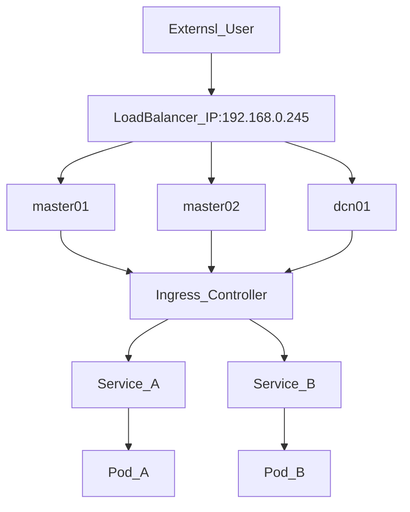

## 1. Kubernetes Load Balancer

Kubernetes generally exposes cluster applications in three ways:
- Node Port
- Load Balancer
- Ingress

In this lab cluster, we chose to use a baremetal configuration using [MetalLB Loadbalancer ](https://metallb.universe.tf/) and the Ingress service.

The topology of the lab cluster is shown below:



## 2. Setting up the MetalLB Service

The first step is enable addon on microk8s cluster. When you enable this add on you will be asked for an IP address pool that MetalLB will hand out IPs.

## 2.1 Enabling MetalLB Service

```
microk8s enable metallb
```

Alternatively, you can provide the IP address pool in the enable command. In this lab case, we'll take 192.168.0.40-192.168.0.50:

```
microk8s enable metallb:192.168.0.40-192.168.0.50
```

## 2.2 Configure IPAddressPool resources

It is possible to configure IP address pools that MetalLB will use to allocate IP addresses using custom resources.

For our example lab, create the following custom address pool:

```
# addresspool.yaml
---
apiVersion: metallb.io/v1beta1
kind: IPAddressPool
metadata:
  name: custom-addresspool
  namespace: metallb-system
spec: 
  addresses:
  - 192.168.0.40-192.168.0.50
```

And apply it with:

```
microk8s kubectl apply -f addresspool.yaml
```

## 2.3 Configure Application LoadBalance Service (alb)

Now, we can then configure which address pool MetalLB will use for each LoadBalancer service by setting the metallb.universe.tf/address-pool annotation:

```
# alb-service.yaml

apiVersion: v1
kind: Service
metadata:
  name: alb-service
  annotations:
    metallb.universe.tf/address-pool: default-addresspool
    # A custom-addresspool is possible
spec:
  selector:
    name: nginx
  type: LoadBalancer
  # loadBalancerIP is optional. MetalLB will automatically allocate an IP 
  # from its pool if not specified. You can also specify one manually.
  # loadBalancerIP: x.y.z.a
  ports:
    - protocol: TCP
      port: 80
      targetPort: 80
```

To apply this, run:
```
microk8s kubectl apply -f alb-service.yaml
```

## 2.4 Setting up a MetalLB/Ingress service

For load balancing in a MicroK8s cluster, MetalLB can make use of Ingress. so, let's enable ingress:
```
microk8s enable ingress
```

Now, create a suitable ingress service, using the config file bellow:

```
# ingress-service.yaml

apiVersion: v1
kind: Service
metadata:
  name: ingress
  namespace: ingress
spec:
  selector:
    name: nginx-ingress-microk8s
  type: LoadBalancer
  # loadBalancerIP is optional. MetalLB will automatically allocate an IP 
  # from its pool if not specified. You can also specify one manually.
  # loadBalancerIP: x.y.z.a
  ports:
    - name: http
      protocol: TCP
      port: 80
      targetPort: 80
    - name: https
      protocol: TCP
      port: 443
      targetPort: 443
```

To apply configuratio, run:

```
microk8s kubectl apply -f ingress-service.yaml
```


Now there is a load-balancer which listens on an arbitrary IP and directs traffic towards one of the listening ingress controllers.
Let's check it:

```
microk8s kubectl get svc
```

...the result is something like this:

```
NAME          TYPE           CLUSTER-IP       EXTERNAL-IP     PORT(S)        AGE
alb-service   LoadBalancer   10.152.183.233   192.168.0.240   80:32599/TCP   10m
kubernetes    ClusterIP      10.152.183.1     <none>          443/TCP        6d5h
```
