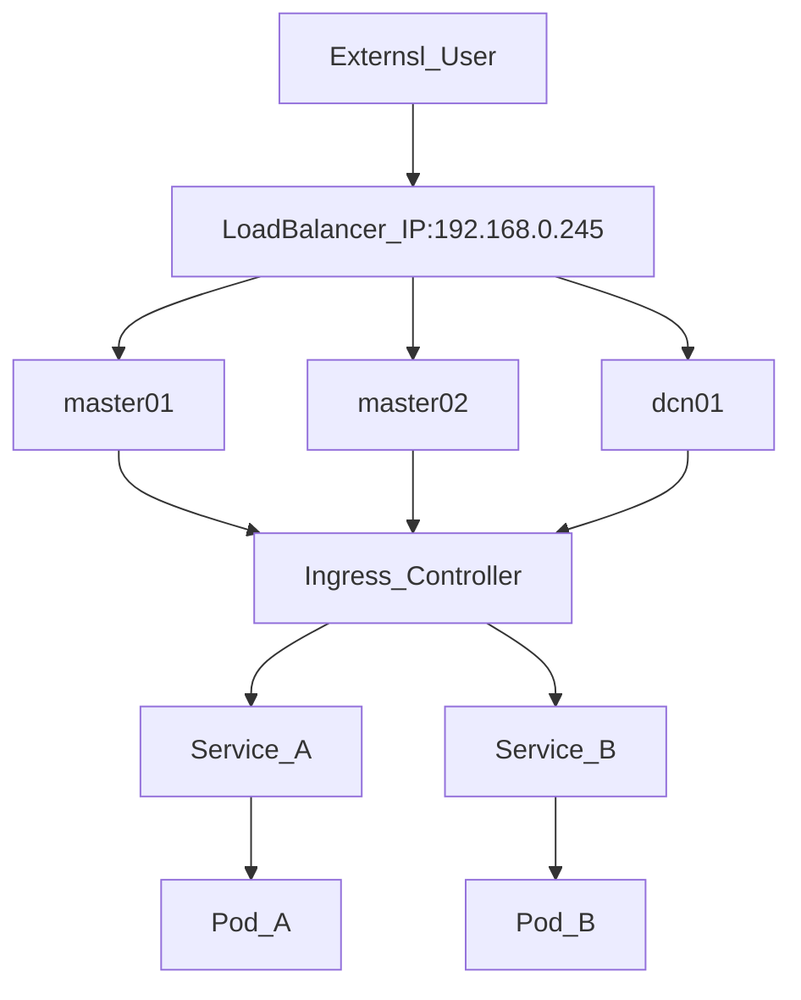

## 1. Kubernetes Load Balancer

Kubernetes generally exposes cluster applications in three ways:
- Node Port
- Load Balancer
- Ingress

In this lab cluster, we chose to use a baremetal configuration using [MetalLB Loadbalancer ](https://metallb.universe.tf/) and the Ingress service.

The topology of the lab cluster is shown below:



## 2. Setting up a MetalLB Service

The first step is enable addon on microk8s cluster. When you enable this add on you will be asked for an IP address pool that MetalLB will hand out IPs from:

```
microk8s enable metallb
```

Alternatively, you can provide the IP address pool in the enable command. In this lab case, we'll take 192.168.0.40-192.168.0.50:

```
microk8s enable metallb:192.168.0.40-192.168.0.50
```


### Setting up a MetalLB Service
