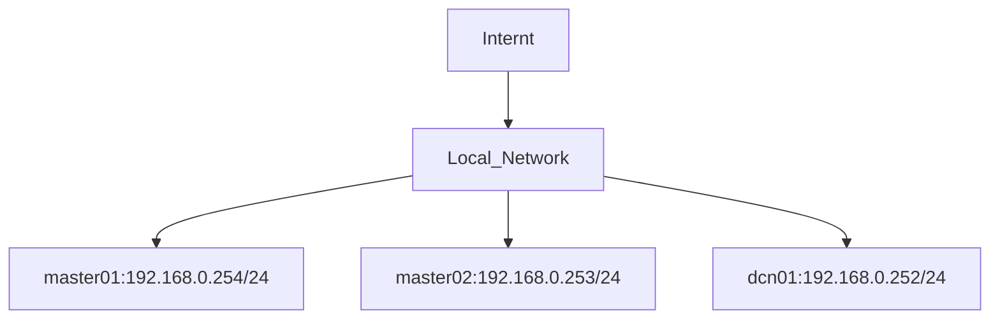

## Creating a High Availability (HA) Kubernetes Cluster Using Three Nodes

In this lab, we are using two master nodes in HA configuration and one compute node. We will define the network topology and configure the entire lab environment 
using three VMs running the latest version of Ubuntu Server.

### 1. Lab setup.
The network topology consists of a 192.168.0.0/24 local network with internet access for all hosts, **master01** (192.168.0.254/24), **master02** (192.168.0.253/24), 
and **dcn01** (192.168.0.252/24), as seen below:



#### 1.1. Network configuration

Configure the IP addresses of the cluster nodes and the /etc/hosts file as below:

```
# Add these lines to /etc/hosts

192.168.0.254 master01
192.168.0.253 master02
192.168.0.252 dcn01

```

No arquivo de configuração do netplan (por exemplo: /etc/netplan/50-cloud-init.yaml), coloque algo assim:

```
network:
  version: 2
  ethernets:
    enp0s8: # Change the Node Interface
      addresses:
        - 192.168.0.252/24 # Change the Node IP Address
      routes:
        - to: default
          via: 192.168.0.1
      nameservers:
        addresses:
           - 127.0.0.53
           - 181.213.132.2
           - 8.8.8.8
           - 8.8.4.4
```


### 2. Install microk8s on each VM using snap

#### 2.1 Install MicroK8s
MicroK8s will install a minimal, lightweight Kubernetes you can run and use on practically any machine. **Perform these steps for all VMs!**
It can be installed with a snap:

```
sudo snap install microk8s --classic
```

#### 2.2 Join the group
MicroK8s creates a group to enable seamless usage of commands which require admin privilege. 
To add your current user to the group and gain access to the .kube caching directory, run the following three commands:

```
sudo usermod -a -G microk8s $USER
mkdir -p ~/.kube
chmod 0700 ~/.kube
```

You will also need to set up local Kubernetes. To do this, do the following:

```
su - $USER
microk8s config > ~/.kube/config
```

#### 2.2 Check the status
MicroK8s has a built-in command to display its status. During installation you can use the --wait-ready flag to wait for the Kubernetes services to initialise:

```
microk8s status --wait-ready
```

#### 2.3 Access Kubernetes

MicroK8s bundles its own version of kubectl for accessing Kubernetes. Use it to run commands to monitor and control your Kubernetes. 

To view your node:
```
microk8s kubectl get nodes
```

To view your services:
```
microk8s kubectl get services
```

### 3. Adding nodes to the cluster managed by master01 node

To create a cluster out of two or more already-running MicroK8s instances, use the microk8s add-node command. 
The MicroK8s instance on which this command is run will be the master of the cluster and will host the Kubernetes control plane.

#### 3.1 Generating join commands (on master01 node):

Run the command:
```
microk8s add-node
```
This will return some joining instructions which should be executed on the MicroK8s instance that you wish to join to the cluster, as seen below:


```
From the node you wish to join to this cluster, run the following:
microk8s join 192.168.0.254:25000/92b2db237428470dc4fcfc4ebbd9dc81/2c0cb3284b05

Use the '--worker' flag to join a node as a worker not running the control plane, eg:
microk8s join 192.168.0.254:25000/92b2db237428470dc4fcfc4ebbd9dc81/2c0cb3284b05 --worker

If the node you are adding is not reachable through the default interface you can use one of the following:
microk8s join 192.168.0.254:25000/92b2db237428470dc4fcfc4ebbd9dc81/2c0cb3284b05
microk8s join 10.23.209.1:25000/92b2db237428470dc4fcfc4ebbd9dc81/2c0cb3284b05
microk8s join 172.17.0.1:25000/92b2db237428470dc4fcfc4ebbd9dc81/2c0cb3284b05
```

#### 3.2 Joining a Controller Node (on master02 node):
To join the master02 node as a cluster controller, run the first command listed in the output of the "microk8s add-node" command run in step 3.1. 
Something like this:

```
microk8s join 192.168.0.254:25000/92b2db237428470dc4fcfc4ebbd9dc81/2c0cb3284b05
```

Joining a node to the cluster should only take a few seconds. Afterwards
you should be able to see the node has joined:

```
microk8s kubectl get no
```
The above command will return output similar to:

```
NAME       STATUS   ROLES    AGE     VERSION
master01   Ready    <none>   5d2h    v1.32.2
master02   Ready    <none>   2d13h   v1.32.2
```

#### 3.3 Joining a Work Node (on dcn01 node):
To join the dcn01 node as a work, run the second command listed in the output of the "microk8s add-node" command run in step 3.1, adding "--worker" at the end of line. 
Something like this:

```
microk8s join 192.168.0.254:25000/92b2db237428470dc4fcfc4ebbd9dc81/2c0cb3284b05 --worker
```


### 4. Testing

#### 4.1 Check Node Status (on master01 node):

Run the command:
```
microk8s kubectl get no
```

The above command will return output similar to:
```
NAME       STATUS   ROLES    AGE     VERSION
dcn01      Ready    <none>   2d20h   v1.32.2
master01   Ready    <none>   5d2h    v1.32.2
master02   Ready    <none>   2d13h   v1.32.2
```

#### 4.1 Check Node Status (on master02 node):

Run the command:
```
microk8s kubectl get no
```

The above command will return output similar to:
```
NAME       STATUS   ROLES    AGE     VERSION
dcn01      Ready    <none>   2d20h   v1.32.2
master01   Ready    <none>   5d2h    v1.32.2
master02   Ready    <none>   2d13h   v1.32.2
```

#### 4.2 Check Node Status (on dcn node):

Run the command:
```
microk8s kubectl get no
```

The above command will return output similar to:
```
This MicroK8s deployment is acting as a node in a cluster. Please use the microk8s kubectl on the master.
```

That's all!


